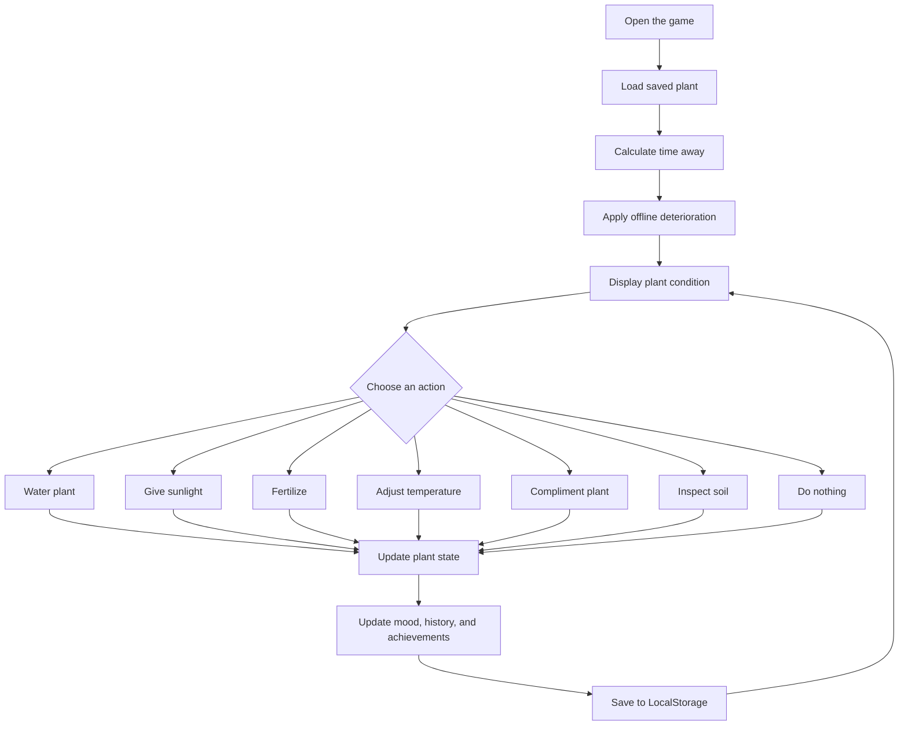

# The needy Plant 🎯

## Basic Details
### Team Name: 404Found

### Team Members
- Team Lead: EB Fathima Suhana - Sree Narayana Gurukulam College of Engineering
- Member 2: Nimisha Roy - Sree Narayana Gurukulam College of Engineering

### Project Description
Do you think of yourself as a gardener? 
Do you think you have what it takes to nurture a plant?
Then let's put your confidence to test through a little survival game.
Let's see which one of you will emerge unscathed - whether mentally or physically.

### The Problem (that doesn't exist)

People already have enough real responsibilities, so we decided to create another one. The player must care for a plant that exists only inside the browser. The plant remembers neglect, complains about care, changes its requirements, and occasionally punishes the player for doing exactly what it asked.

The game is intentionally unnecessary. It turns simple plant care into a strangely serious responsibility involving unpredictable watering intervals, emotional support, sunlight management, pointless actions, and absurd plant bureaucracy

### The Solution (that nobody asked for)

People already have enough real responsibilities, so we decided to create another one. The player must care for a plant that exists only inside the browser. The plant remembers neglect, complains about care, changes its requirements, and occasionally punishes the player for doing exactly what it asked.

The game is intentionally unnecessary. It turns simple plant care into a strangely serious responsibility involving unpredictable watering intervals, emotional support, sunlight management, pointless actions, and absurd plant bureaucracy

## Technical Details
### Technologies/Components Used
For Software:
- HTML5, CSS3, javascript.
- chatgpt, claude, manusAI, freebuff.

### Implementation
For Software:
git clone [github repo](https://github.com/welive22/useless_project_temp)
cd useless project temp

### Project Documentation
For Software:

## Screenshots

### Main Game Screen

*The main screen shows the pixel-art plant, its current mood, health meters, and care actions.*

### Care Actions

*The player can water, fertilize, compliment, or otherwise inconvenience the plant.*

### History and Achievements

*The game records the player's unnecessary commitment through history and achievements.*

# Diagrams
## Diagrams

## Game Workflow

*The game loads the saved plant, calculates time away, applies offline deterioration, processes the player's action, and saves the updated state locally in the browser.*

### Project Demo
## Project Demo

[Watch the gameplay demo on Google Drive](https://drive.google.com/file/d/1YVwadRlpBz5FqQXL06TBVk5ZKipfl3rE/view?usp=sharing)
*Explain what the video demonstrates*

# Additional Demos
[Add any extra demo materials/links]

## Team Contributions
- [Name 1]: [Specific contributions]
- [Name 2]: [Specific contributions]
- [Name 3]: [Specific contributions]

---
Made with ❤️ at TinkerHub Useless Projects 

